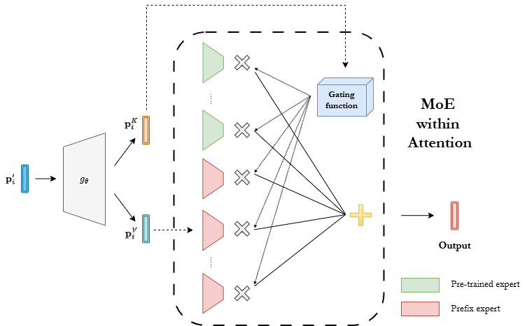

# Revisiting Prefix-tuning: Statistical Benefits of Reparameterization among Prompts (ICLR 2025)

This repository is the official implementation of `Revisiting Prefix-tuning: Statistical Benefits of Reparameterization among Prompts` (ICLR 2025).

<a href="https://arxiv.org/abs/2410.02200"></a>

Prompt-based techniques, such as prompt-tuning and prefix-tuning, have gained prominence for their efficiency in fine-tuning large pre-trained models. Despite their widespread adoption, the theoretical foundations of these methods remain limited. For instance, in prefix-tuning, we observe that a key factor in achieving performance parity with full fine-tuning lies in the reparameterization strategy. However, the theoretical principles underpinning the effectiveness of this approach have yet to be thoroughly examined. Our study demonstrates that reparameterization is not merely an engineering trick but is grounded in deep theoretical foundations. Specifically, we show that the reparameterization strategy implicitly encodes a shared structure between prefix key and value vectors. Building on recent insights into the connection between prefix-tuning and mixture of experts models, we further illustrate that this shared structure significantly improves sample efficiency in parameter estimation compared to non-shared alternatives. The effectiveness of prefix-tuning across diverse tasks is empirically confirmed to be enhanced by the shared structure, through extensive experiments in both visual and language domains. Additionally, we uncover similar structural benefits in prompt-tuning, offering new perspectives on its success. Our findings provide theoretical and empirical contributions, advancing the understanding of prompt-based methods and their underlying mechanisms.



## Requirements

- Python 3.8.5

```setup
pip install torch==1.7.1+cu110 torchvision==0.8.2+cu110 -f https://download.pytorch.org/whl/torch_stable.html

# for VTAB datasets
pip install tensorflow==2.9.1 tensorflow-addons==0.17.1 keras==2.9.0 tfds-nightly==4.4.0.dev202201080107

pip install tqdm fvcore==0.1.5.post20220512 pandas six simplejson scikit-learn timm==0.5.4 ml_collections
```


## Usage

To run our experiments in CV and NLP domains, please go to the corresponding directories and follow the instructions in the README files.

If you encounter any issues or have any questions, please let us know. 

## Acknowledgement
This repository is developed mainly based on the PyTorch implementation of [vpt](https://github.com/KMnP/vpt) and [PrefixTuning](https://github.com/XiangLi1999/PrefixTuning). Many thanks to its contributors!


## **Citation**

If you find this code helpful to your work, please cite our paper:

```bibtex
@inproceedings{le2024revisiting,
    title={Revisiting Prefix-tuning: Statistical Benefits of Reparameterization among Prompts},
    author={Le, Minh and Nguyen, Chau and Nguyen, Huy and Tran, Quyen and Le, Trung and Ho, Nhat},
    booktitle={The Thirteenth International Conference on Learning Representations},
    year={2025}
}
```